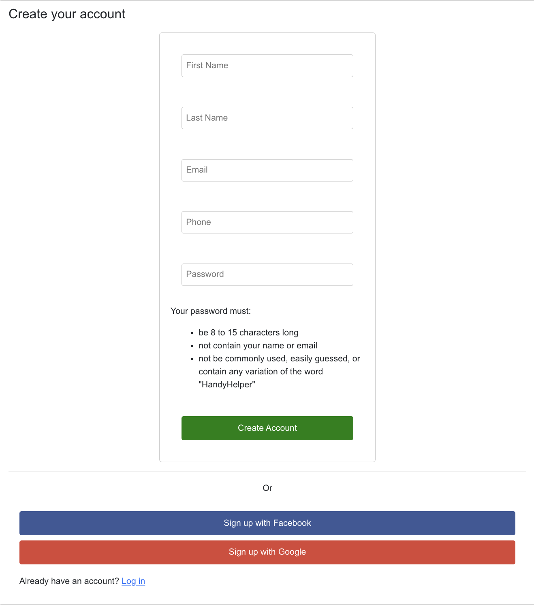

# HandyHelper - Service Management Platform

HandyHelper is a service management platform that allows users to book and manage various services. This project is built with the MERN stack (MongoDB, Express.js, React.js, Node.js) and Flutter for mobile applications.

https://youtu.be/NB7uBwp0h34

## Features

### Admin Role

- **Dashboard:** Overview of service operations, including current bookings and service status.
- **Service Management:** Manage service availability, add new services, and update service details.
- **Booking Management:** View, edit, and cancel bookings made by users.
- **Customer Management:** Access customer profiles, view booking history, and update guest information.

### User Role

- **Service Search:** Browse available services based on categories and preferences.
- **Booking:** Make service reservations with customer details and preferences.
- **Booking History:** View and manage personal booking history.
- **Profile Management:** Update personal details, preferences, and view invoices.
- **Add to Favorites:** Save preferred services for future bookings.
- **Rate and Reviews:** Comment on their service and rate then out of 5.

## Technologies

- **MongoDB:** Database for storing service, booking, and user data.
- **Express.js:** Backend framework for handling API requests.
- **React.js:** Frontend library for building user interfaces.
- **Node.js:** JavaScript runtime for backend development.
- **Bootstrap:** UI styling framework.

## API Integration

The frontend communicates with the backend via a RESTful API, handling operations for both Admin and User roles, such as service management, bookings, and customer data.

## Future Work

- **Mobile Optimization:** Enhance responsiveness and usability on mobile devices.
- **Multi-Language Support:** Add support for multiple languages to cater to a diverse user base.
- **Advanced Analytics:** Integrate advanced analytics for admins to monitor booking trends, service usage, and customer demographics.
- **Real-Time Notifications:** Implement a notification system to alert users about service updates and reminders.

## Challenges

- **API Integration:** Ensuring smooth and secure API communication, especially with sensitive data like customer information and payments, required careful planning and testing.
- **Responsive Design:** Maintaining a consistent and user-friendly interface across different screen sizes was challenging but achieved through Bootstrap.

## Environment Variables

- `REACT_APP_API_URL`: http://localhost:3000/

## Author

- **Chewan Rai**

## Appendix

- **Figure 1:** Homepage
  
- **Figure 2:** Services Pagination
  
- **Figure 3:** Service Details
  
- **Figure 4:** User Registration
  
- **Figure 5:** User Login
  
- **Figure 6:** Pro Dashboard
  
- **Figure 7:** Servie Update
  
- **Figure 8:** Plan for Later
  
- **Figure 9:** User Profile Update
  
- **Figure 10:** Forgot Password
  
